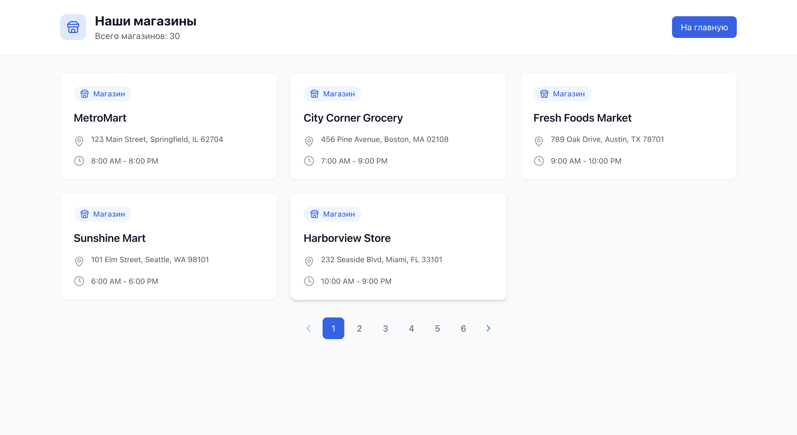

# StoreFlow
This is my implementation of the second laboratory work.

## Backend
I have decided to implement a little bit heavy architecture for this project, but it is also very scalable. I divided it in this way:

So, this architecture divides responsibilities on three different levels, which allows to to independently develop and test each of them. 

Let's go through *some definitions*:

**Repository** - is a kind of abstraction above a database, that isolates data access logic from other application. We can perform all CRUD (*Create-Read-Update-Delete*) operations only here. We do not write any business logic in repositories.

**Service** - is a business-logic layer. Here we perform all operations and processes on the data. It allows us to add new logic without changing data-collecting part.

**Router** - is a layer that handles the routing of HTTP requests and communication with the corresponding services.

As you can see, I have repositories, services and routers for each individual part of the application: stores, products and sales (analytics).

Diving deeper into the code, there is a `dependencies.py` file where I take all of my dependencies (obviously), such as, StoreRepository and StoreService etc. This file is aimed to be a <u>centralized storage</u> of all functions that I need to load any of dependencies.

#### Tech Stack:
:snake: Python FastAPI  
💾 SQlite3  
🧠 My skills  

---
## Frontend

In general, there are *4 pages* in the frontend:

Of course it is very cool and interesting, but I think it is better to let the pictures speak for themselves here:

**Landing Page**:

**Stores Page**:

**Products Page**:

**Analytics Page**:

#### Tech Stack: 
⚙️ React Typescript  
🎨 Tailwindcss  
🤖 ChatGPT  

---

## Thoughts
I think that there is a little mistake in my *repositories*, because I format data and throw exceptions there. But as I said, repositories must only get data, not transfrom or format it.

Likewise, I think I should optimize an SQL query in the <u>sales repository</u>, bacause it works kinda slow even on my local machine, cannot image what will be on the claud servers :skull:

And it will be aslo cool to add some ML algorithm here to predict something. It will be cooler if the algorithm is self-implemented from scratch :sunglasses:

So, to conclude I am gonna do this.
### To Do
1. Transfer business logic from repositories to services
2. Optimize the SQL queries
3. Add ML algorithm
4. Change offset-based pagination to cursor-based pagination in backend